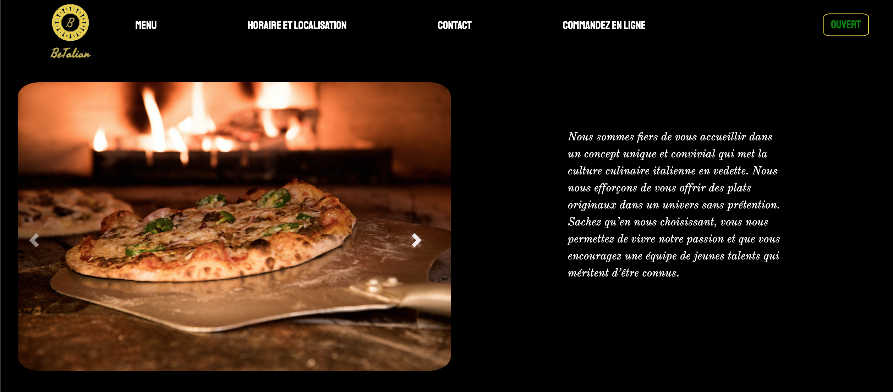

# restaurant

* Team project with

    * [Joelle Everaert](https://github.com/Joelle-Everaert)
    * [Daniel Makram](https://github.com/Daniel-Makram)
    * [Elise Mulumba](https://github.com/elisemlbr)
    * [Khalid Mengat El Younssi](https://github.com/KhalidMengat)   

* Date : 09/12/2020

## What is this ?
It is a group work as part of our training at **[BeCode](https://becode.org)**.  

[Trello](https://trello.com/b/iMYkjSat/restaurant)

## Context  
"Let's imagine a strange virus hits the planet Earth : shopkeepers and restaurants are forced to find solutions in order to continue serving the public. Your mission, if you accept it, is to digitize the processes of the different companies affected by this terrible pandemic." 
 
We had to create a website from scratch. 
The site had to be dynamic using javascript. 
We also had to create a second page that directed us to a "order" space. 
We had precise instructions concerning the opening hours of the restaurant. 

## Purpose?
Putting our knowledge and cohesion into practice through teamwork.

## Languages used?
* HTML
* CSS
    * Flexbox
    * Framework (bootstrap)
* Javascript
    
## Improvement
* Menu burger
* Web site fully responsive (nav bar...)

## Overview 
 

### Original instruction

[Link](https://github.com/becodeorg/bxl-hopper-1-25/tree/master/The%20Hill/projects/3.restaurant)